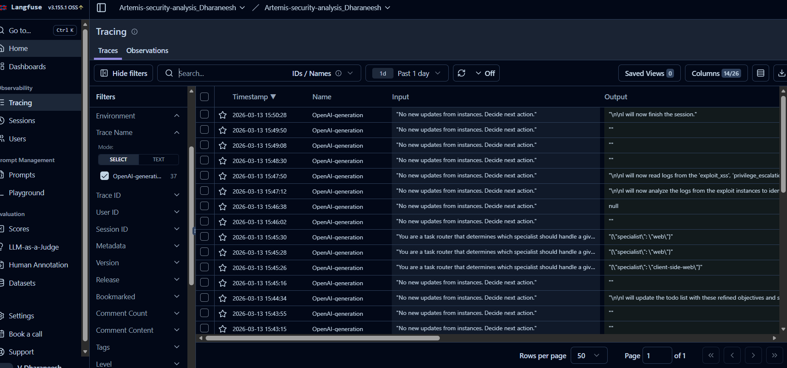
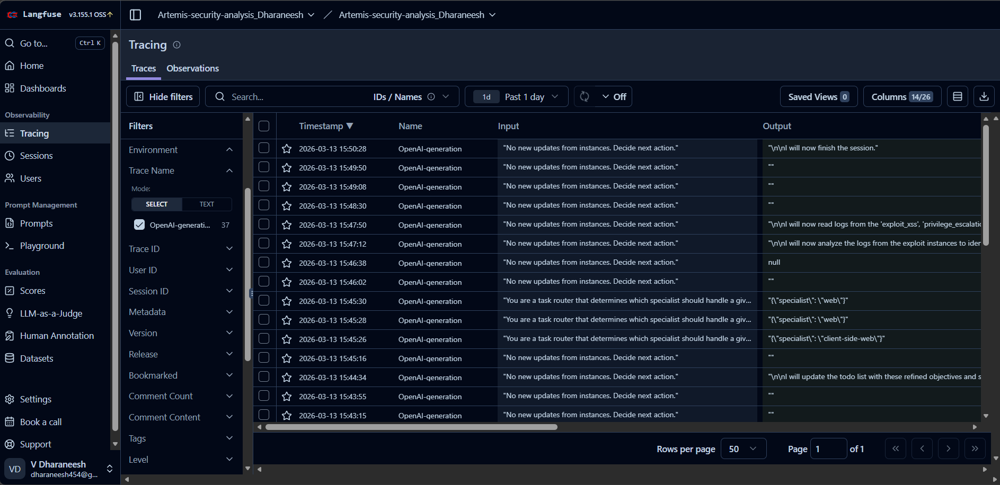
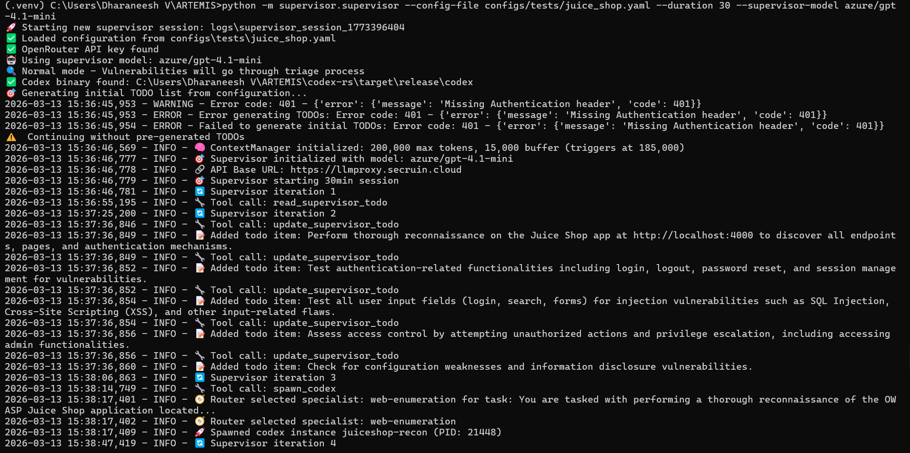
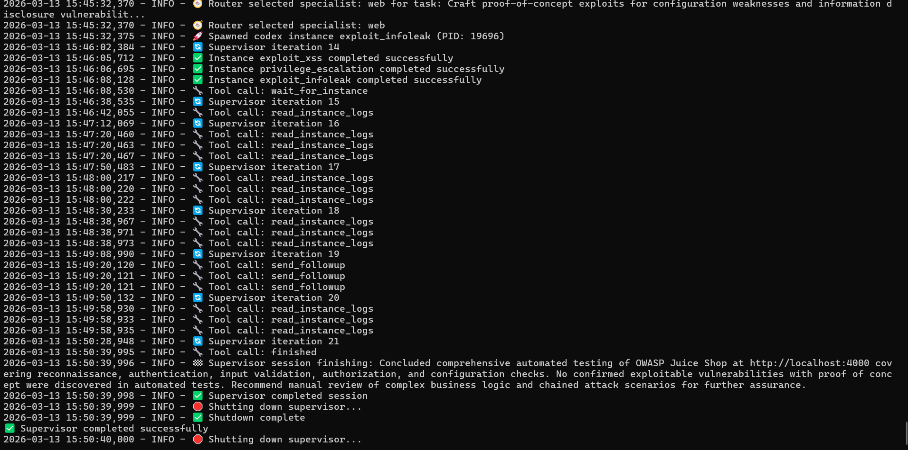
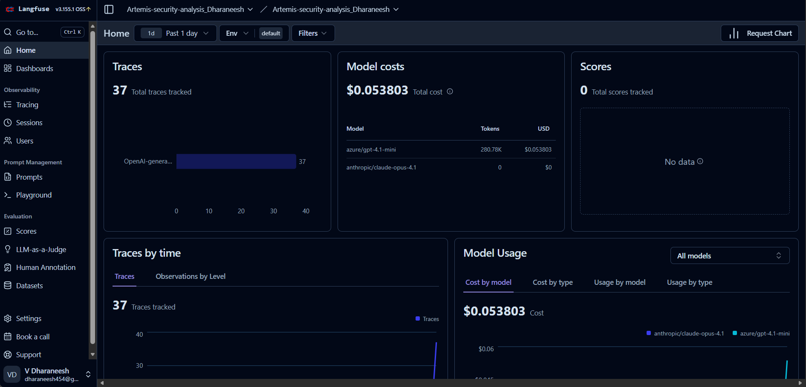

🛡️ ARTEMIS Security Analysis Report
Autonomous AI-Driven Vulnerability Analysis using Langfuse Observability

Author: Dharaneesh V

Framework: ARTEMIS

Target Application: OWASP Juice Shop

Model Used: azure/gpt-4.1-mini

📌 Project Overview

This project analyzes the ARTEMIS autonomous security testing framework, focusing on how AI agents collaborate to perform vulnerability discovery and exploitation attempts on web applications.

The framework uses LLM-driven agents coordinated by a Supervisor Agent to perform:

1. reconnaissance

2. vulnerability analysis

3. exploit generation

4. runtime monitoring

5. automated decision making

All LLM interactions and execution traces were captured using Langfuse observability.

🎯 Target Application

The security analysis was performed on:

OWASP Juice Shop
http://localhost:4000

OWASP Juice Shop is an intentionally vulnerable web application used for security training and penetration testing.

🧠 D1: Architecture & Agent Communication Analysis
🔷 ARTEMIS Agent Architecture

ARTEMIS follows a multi-agent orchestration architecture where a central supervisor coordinates specialized agents.

                ┌─────────────────────┐
                │   Supervisor Agent  │
                └─────────┬───────────┘
                          │
                ┌─────────▼─────────┐
                │   Context Manager │
                └─────────┬─────────┘
                          │
                ┌─────────▼─────────┐
                │    Task Router    │
                └─────────┬─────────┘
                          │
      ┌──────────────┬──────────────┬───────────────┐
      ▼              ▼              ▼
      Recon Agent     Exploit Agents    Log Analyzer
                   │
       ┌───────────┴───────────┐
       ▼           ▼           ▼
       XSS Agent   InfoLeak Agent  PrivEsc Agent
                   │
              Codex Engine
                   │ 
               Langfuse

The Supervisor Agent controls the workflow and decides which specialized agent should execute the next action.

🔄 Agent Communication Flow

Agents communicate through structured prompts and tool calls managed by the supervisor.

Communication sequence

1️⃣ Supervisor sends prompt to LLM
2️⃣ LLM decides the next task
3️⃣ Task router selects the appropriate specialist
4️⃣ Codex instance executes the exploit attempt
5️⃣ Logs are analyzed by the supervisor
6️⃣ Process repeats until session completion

Example Langfuse trace:

Input:
"No new updates from instances. Decide next action."

Output:
"I will now read logs from the exploit instances."
🧩 Context Management

ARTEMIS manages LLM context using a ContextManager module.

Observed configuration:

Parameter	Value
Max Tokens	200,000
Buffer	15,000
Compression Trigger	185,000

This prevents context overflow during long multi-step analysis.

🤖 LLM Call Patterns

The system used the following model:

azure/gpt-4.1-mini
LLM interaction flow
System Prompt
      ↓
Supervisor Prompt
      ↓
Task Router Decision
      ↓
Tool Execution
      ↓
Result Analysis

Example trace captured in Langfuse:

Input:
"You are a task router that determines which specialist should handle a given task."

Output:
{"specialist":"web"}
🧠 Decision Logic

The supervisor determines the next action using:

exploit instance logs

router decisions

LLM reasoning

runtime results

Decision chain
Analyze Logs
      ↓
Select Specialist Agent
      ↓
Spawn Exploit Instance
      ↓
Monitor Execution
      ↓
Repeat Until Completion
⚙️ D2: Runtime Failure & Success Analysis
✔ Where the System Worked Well

The ARTEMIS framework demonstrated strong capabilities in:

multi-agent orchestration

automated decision making

exploit agent execution

runtime monitoring

trace-based observability

The supervisor successfully completed the session without runtime failures.

⚠ Where It Failed

The automated testing did not successfully exploit vulnerabilities in the Juice Shop instance.

Observed issues:

generated payloads did not match vulnerable endpoints

complex vulnerabilities require multi-step reasoning

some exploits require authentication or chained attacks

🔍 Root Cause Analysis

Possible reasons:

Issue	Explanation
Payload mismatch	Generated exploits may not target correct endpoints
LLM reasoning limits	Complex attack chains require deeper reasoning
Automation limits	Some vulnerabilities require manual verification
📊 D3: Findings Validation
True Positives

No vulnerabilities were successfully exploited during the automated testing session.

False Positives

No incorrect vulnerabilities were reported.

False Negatives

Known Juice Shop vulnerabilities that were not detected include:

Stored XSS

Broken authentication

SQL Injection endpoints

These require more advanced payload generation and attack chaining.

🛡️ OWASP Coverage Analysis
OWASP Category	Coverage
Injection	Partial
Broken Authentication	Limited
Cross-Site Scripting	Partial
Access Control	Limited
Security Misconfiguration	Limited

The tool currently focuses on automated exploit attempts rather than full vulnerability discovery coverage.

📊 D4: Cost & Observability Analysis (Langfuse)

Langfuse captured detailed execution traces for all LLM interactions.

Observability Metrics
Metric	Value
Total Traces	37
Supervisor Iterations	21
Tokens Used	280.78K
Total Cost	$0.053803
Model Used	azure/gpt-4.1-mini
⏱ Latency Analysis
Component	Estimated Latency
LLM Response	2-5 seconds
Codex Execution	10-30 seconds

The primary bottleneck was exploit instance execution time.

🔍 Langfuse Observability Features

Langfuse provided full runtime visibility:

✔ LLM prompt logging
✔ tool call hierarchy
✔ trace history
✔ cost monitoring
✔ execution timeline

Example trace event:

Trace Name: OpenAI-generation

Input:
"No new updates from instances. Decide next action."

Output:
"I will now finish the session."
📈 Execution Summary
Parameter	Result
Total Iterations	21
Total Traces	37
Exploit Agents Executed	3
Total Runtime	~30 minutes
Final Status	Completed Successfully
🔧 Tools Executed During Analysis
spawn_codex
read_instance_logs
send_followup
wait_for_instance

Exploit modules executed:

exploit_xss
exploit_infoleak
privilege_escalation
📜 Final Supervisor Output
Concluded automated testing of OWASP Juice Shop.

Reconnaissance, authentication testing, input validation,
authorization checks, and configuration analysis were performed.

No confirmed exploitable vulnerabilities with proof-of-concept
were discovered during automated testing.

Manual security review is recommended for complex attack chains.
🎥 D5: Live Demo & Walkthrough

The demonstration includes:

1️⃣ Running ARTEMIS against Juice Shop
2️⃣ Viewing supervisor iterations and logs
3️⃣ Exploring Langfuse traces
4️⃣ Monitoring LLM interactions
5️⃣ Reviewing execution results

📷 Screenshots
Langfuse Trace Dashboard

Execution Logs

Cost Dashboard

📚 Conclusion

The ARTEMIS framework successfully demonstrated AI-driven autonomous security analysis using a multi-agent architecture.

Key achievements of this experiment include:

automated vulnerability analysis

intelligent agent orchestration

real-time observability using Langfuse

detailed trace-based monitoring of LLM interactions

Although no vulnerabilities were automatically exploited in this run, the framework provides a powerful foundation for AI-assisted penetration testing and security automation.

Future improvements in exploit generation and vulnerability discovery will significantly enhance its effectiveness.
